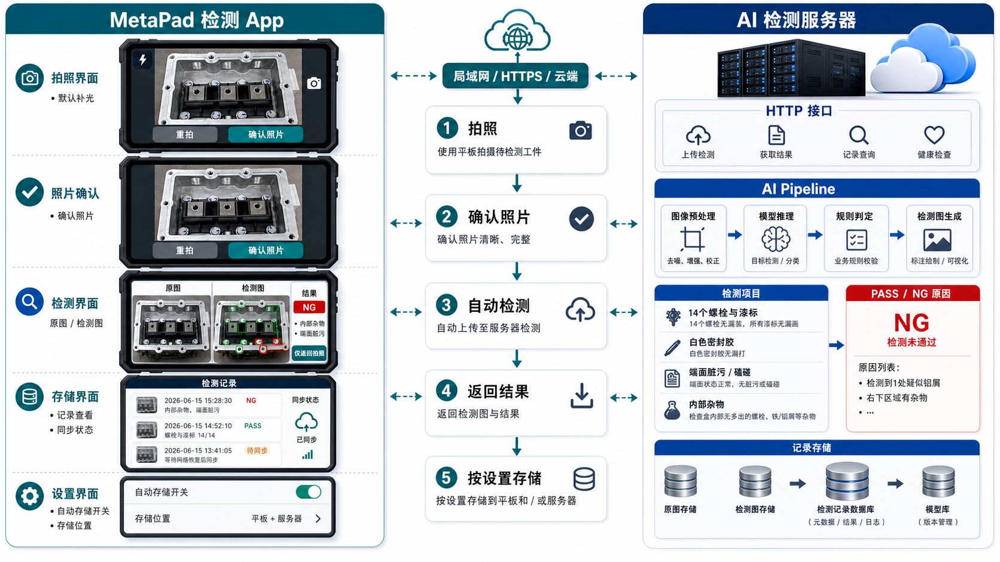
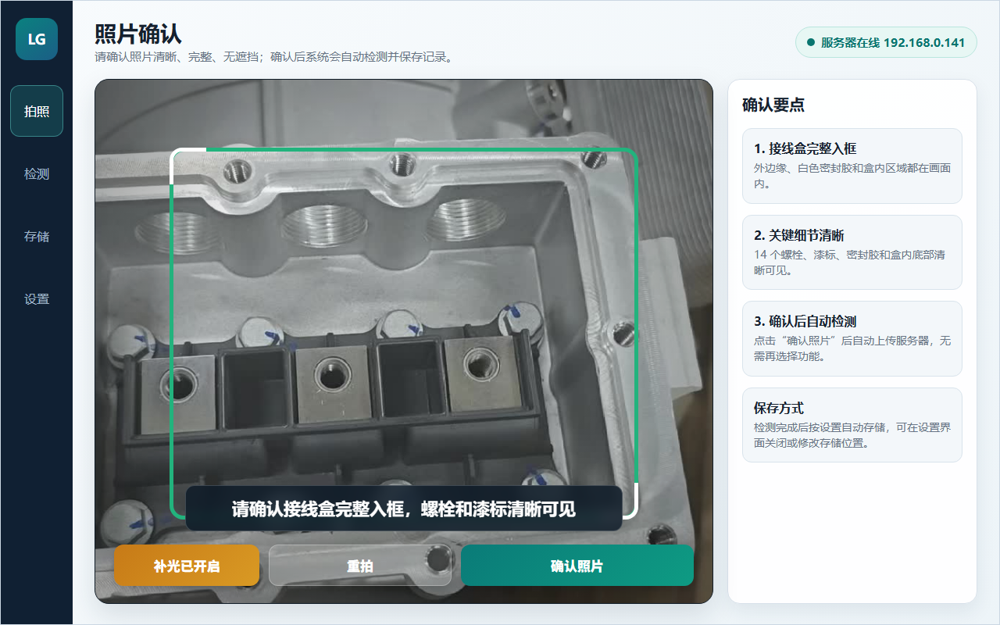
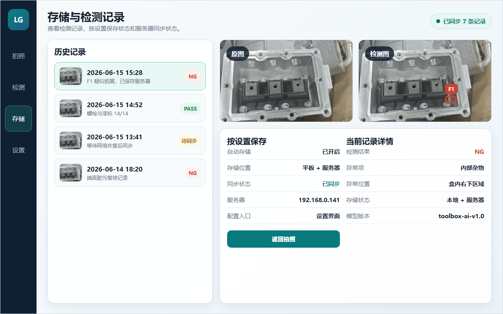

# MetaPad 工具箱视觉检测 App 设计文档

版本：v0.1 原型阶段  
日期：2026-06-15  
目标设备：华为 MetaPad / Android 平板  
核心形态：MetaPad 原生 APK + AI 检测服务器

> 当前图片和界面图用于原型阶段的结构对齐，不作为最终 UI 视觉稿。后续进入开发阶段后，需要基于真实相机画面、现场操作距离、平板分辨率和检测模型输出继续细化。

## 1. 项目目标

本项目用于接线盒 / 工具箱类结构件的现场视觉检测。操作人员使用 MetaPad 安装的 APK 进行拍照，App 在拍照界面给出简单取景提示并默认开启补光灯；拍照后由用户确认照片是否可用，确认后自动上传到本机或远程 AI 检测服务器。服务器完成视觉检测并返回检测图、通过/未通过结果和原因，App 自动展示结果并保存记录。

核心流程：

```text
拍照 -> 照片确认 -> 自动上传检测 -> 自动展示结果 -> 按设置存储
```

## 2. 检测内容

第一版视觉检测范围包括四类：

1. 14 个螺栓无漏装，所有漆标无漏画。
2. 白色密封胶无漏打。
3. 接线盒端面无脏污、磕碰等缺陷。
4. 接线盒内部无多出的螺栓、铁屑、铝屑等杂物。

总结果分为：

```text
PASS：全部检测项通过
NG：任意检测项未通过
REVIEW：模型置信度不足，需要人工复核
```

## 3. 架构总览

推荐架构：

```text
模块化 Android + Clean Architecture + 轻量 DDD + MVVM/MVI 单向数据流
```

服务端推荐架构：

```text
Python AI Server + HTTP API + AI Pipeline + 模型版本管理 + 记录存储
```

新版架构图：



## 4. Android App 模块设计

建议 Gradle 模块：

```text
:app                    宿主工程，启动、导航、依赖注入、主题
:core-common            Result、Error、时间、ID、通用类型
:core-ui                通用 UI 组件、主题、图像预览组件
:core-platform          相机、权限、日志、网络基础配置
:domain                 领域模型和业务规则
:application            用例层，业务流程编排
:data                   Repository 实现、网络、Room、DataStore、文件
:feature-capture        拍照引导界面
:feature-inspection     检测结果界面
:feature-storage        存储与历史记录界面
```

依赖方向：

```text
feature -> application -> domain
data -> domain
data -> core-platform
app -> feature
```

约束：

- `domain` 不依赖 Android、Compose、CameraX、Retrofit、Room。
- `application` 只编排业务流程，不直接操作 HTTP、数据库、文件系统。
- `feature` 只处理 UI、ViewModel、UiState、UiEvent。
- `data` 和 `core-platform` 处理具体技术实现。

## 5. 工人端极简界面设计

现场反馈要求界面不要复杂。设计原则调整为：底层能力保留，但不把太多按钮暴露给工人。工人端只保留必要动作，检测后只允许返回拍照；是否自动存储在设置界面中配置。

简化后的工人端流程：

```text
拍照 -> 照片确认 -> 自动上传检测 -> 自动展示结果 -> 按设置存储
```

界面仍保留三个主要入口，但职责收敛：

```text
拍照界面：负责简单取景提示、默认补光、拍照和照片确认。
检测界面：负责自动展示检测结果，只保留“返回拍照”按钮。
存储界面：主要用于查看历史记录。
设置界面：配置是否自动存储、存储位置、服务器地址等管理项。
```

### 5.1 拍照界面

目标：让用户完成拍照，并在拍照后确认照片是否可用。

核心能力：

- CameraX 相机预览。
- 进入页面默认开启补光灯。
- 显示简单取景框和固定拍摄提示。
- 拍照后进入照片确认页。
- 用户点击“确认照片”后自动上传检测。
- 用户认为照片不好时点击“重拍”。

原型图：



> 拍照界面必须保持简单。第一版不做实时移动指导，只保留取景框、默认补光、拍照、重拍、确认照片。

固定拍摄提示示例：

```text
请将接线盒完整放入取景框
请确认 14 个螺栓和漆标清晰可见
请确认白色密封胶完整入框
请确认盒内无明显遮挡
补光灯已开启
```

拍照页状态：

```text
预览中
已拍照待确认
确认后自动检测
上传中
```

### 5.2 检测界面

目标：自动展示原图、检测图、总结果和四类检测项结果。

核心能力：

- 展示原图。
- 展示服务器返回的检测图。
- 显示 PASS / NG / REVIEW。
- 显示四类检测清单。
- 对异常项显示原因、位置、置信度和建议动作。
- 检测完成后根据设置决定是否自动存储。
- 检测结果页只保留一个操作按钮：返回拍照。

原型图：


检测清单结构：

```text
螺栓与漆标
- 螺栓数量：14/14
- 漆标数量：14/14
- 状态：PASS / NG / REVIEW

白色密封胶
- 状态：连续完整 / 漏打 / 不连续 / 复核

端面脏污 / 磕碰
- 脏污：无 / 有
- 磕碰：无 / 有

内部杂物
- 多余螺栓：无 / 有
- 铁屑：无 / 有
- 铝屑：无 / 有
```

杂物提示规则：

```text
总结果：NG 检测未通过
异常项：内部杂物
提示文案：发现疑似杂物，请清理后返回拍照重新检测。
图像标注：红框标出明确异常，黄框标出疑似异常。
详情示例：F1：盒内右下区域检测到疑似铝屑，置信度 86%。
```

### 5.3 存储界面

目标：查看检测记录和同步状态。存储策略、服务器地址、导出等能力保留在设置界面，不作为工人端高频操作。

核心能力：

- 历史记录列表。
- 记录详情查看。
- 原图和检测图预览。
- 显示按设置保存状态。
- 显示服务器同步状态。
- 同步失败状态只做提示。
- 存储模式、服务器地址、导出记录放入设置界面。

原型图：



存储模式：

```text
PAD_ONLY：只存平板
SERVER_ONLY：只存服务器
PAD_AND_SERVER：平板和服务器都保存
```

设置界面中的存储配置：

```text
自动存储：开启 / 关闭
存储位置：只存平板 / 只存服务器 / 平板和服务器都保存
服务器地址：http://192.168.0.141:8765
连接测试：检查服务器是否可用
```

同步状态：

```text
已保存本地
已同步服务器
等待同步
同步失败
```

### 5.4 设置界面

目标：放置管理配置，避免检测结果页暴露过多操作。

核心能力：

- 自动存储开关。
- 存储位置选择。
- 服务器地址配置。
- 连接测试。
- 后续可扩展操作员、设备编号、模型版本等配置。

工人端默认流程中不强制进入设置界面。检测完成后，检测页只提供“返回拍照”按钮；是否保存由设置界面的自动存储配置决定。

## 6. App 端核心领域模型

建议领域模型：

```kotlin
data class InspectionRecord(
    val id: InspectionRecordId,
    val createdAt: Instant,
    val status: InspectionStatus,
    val originalImageUri: String,
    val detectedImageUri: String?,
    val checks: List<InspectionCheck>,
    val storageMode: StorageMode,
    val syncStatus: SyncStatus,
    val serverRecordId: String?,
    val modelVersion: String?,
    val rawResultJson: String?
)
```

```kotlin
data class InspectionCheck(
    val code: InspectionCheckCode,
    val name: String,
    val status: InspectionStatus,
    val summary: String,
    val findings: List<InspectionFinding>
)
```

```kotlin
data class InspectionFinding(
    val id: String,
    val type: FindingType,
    val label: String,
    val severity: FindingSeverity,
    val confidence: Double?,
    val locationText: String?,
    val bbox: BoundingBox?
)
```

关键枚举：

```text
InspectionStatus：PASS / NG / REVIEW / ERROR
StorageMode：PAD_ONLY / SERVER_ONLY / PAD_AND_SERVER
SyncStatus：LOCAL_ONLY / SYNCED / PENDING / FAILED
ConnectionMode：LAN / HTTPS / CLOUD / TUNNEL
FindingType：MISSING_BOLT / MISSING_PAINT_MARK / SEALANT_MISSING / SURFACE_DIRTY / DENT / FOREIGN_OBJECT
```

## 7. App 端用例设计

核心 UseCase：

```text
CapturePhotoUseCase
ConfirmPhotoUseCase
SubmitInspectionUseCase
SaveInspectionRecordUseCase
LoadInspectionRecordsUseCase
SyncPendingRecordsUseCase
TestServerConnectionUseCase
UpdateStorageModeUseCase
```

拍照页第一版不做实时画面指导，避免界面复杂和工人操作负担。设备能力建议拆成：

```text
TorchController
CaptureController
```

第一版只保留简单质量兜底检查，可在用户确认照片后或上传前执行：

```text
亮度检测
模糊检测
横屏检测
```

后续如果现场确实需要，再以“可选高级模式”加入本地轻量模型或服务器辅助引导，默认工人界面不显示复杂提示。

## 8. AI 检测服务器设计

服务端不是简单文件服务，而是 AI 检测平台雏形。

建议目录：

```text
server/
├─ api
│  ├─ inspection_api.py
│  ├─ record_api.py
│  ├─ model_api.py
│  └─ health_api.py
│
├─ application
│  ├─ submit_inspection.py
│  ├─ generate_report.py
│  └─ manage_model.py
│
├─ domain
│  ├─ inspection_task.py
│  ├─ detection_result.py
│  ├─ finding.py
│  ├─ model_version.py
│  └─ inspection_rule.py
│
├─ ai
│  ├─ preprocess
│  ├─ detectors
│  ├─ classifiers
│  ├─ segmenters
│  ├─ postprocess
│  └─ visualizer
│
├─ infrastructure
│  ├─ storage
│  ├─ database
│  ├─ queue
│  ├─ model_runtime
│  └─ config
│
└─ bootstrap
   └─ main.py
```

AI Pipeline：

```text
接收图片
-> 保存原图
-> 图像预处理
-> 工具箱定位
-> 螺栓/漆标检测
-> 密封胶检测
-> 端面缺陷检测
-> 内部杂物检测
-> 规则融合
-> 生成检测图
-> 保存记录
-> 返回结果
```

## 9. HTTP API 设计

### 9.1 健康检查

```text
GET /api/health
```

返回：

```json
{
  "status": "ok",
  "serverTime": "2026-06-15T15:30:00+08:00",
  "modelVersion": "toolbox-ai-v1.0"
}
```

### 9.2 照片检测

```text
POST /api/inspect
Content-Type: multipart/form-data
```

参数：

```text
image：拍照图片
deviceId：设备 ID
operatorId：操作员，可选
taskType：检测任务类型
clientTime：客户端时间
```

返回：

```json
{
  "recordId": "20260615-0008",
  "status": "NG",
  "summary": "检测未通过",
  "modelVersion": "toolbox-ai-v1.0",
  "originalImageUrl": "/records/20260615-0008/original.jpg",
  "detectedImageUrl": "/records/20260615-0008/detected.jpg",
  "checks": [
    {
      "code": "BOLT_AND_PAINT_MARK",
      "name": "螺栓与漆标",
      "status": "PASS",
      "summary": "螺栓 14/14，漆标 14/14",
      "findings": []
    },
    {
      "code": "FOREIGN_OBJECT",
      "name": "内部杂物",
      "status": "NG",
      "summary": "检测到 1 处疑似杂物",
      "findings": [
        {
          "id": "F1",
          "type": "ALUMINUM_CHIP",
          "label": "疑似铝屑",
          "severity": "NG",
          "confidence": 0.86,
          "locationText": "盒内右下区域",
          "bbox": [820, 460, 880, 510]
        }
      ]
    }
  ]
}
```

### 9.3 查询记录

```text
GET /api/records
GET /api/records/{recordId}
```

### 9.4 同步记录

```text
POST /api/records/sync
```

用于后续非局域网、离线缓存、失败重传。

## 10. 非局域网扩展

App 不应写死局域网地址。服务器配置必须由 DataStore 保存：

```text
serverBaseUrl
connectionMode
authToken
timeout
useHttps
```

第一阶段：

```text
http://192.168.0.141:8765
```

后续阶段：

```text
https://api.example.com
https://frp.example.com
https://ngrok-like-domain
```

公网访问必须补充：

```text
HTTPS
Token 鉴权
设备注册
上传大小限制
访问日志
异常告警
```

## 11. 原型资产

当前设计文档使用以下原型资产：

```text
docs/architecture-ai-inspection-zh.png
android-app/docs/ui-prototype-capture.png
android-app/docs/ui-prototype-inspection.png
android-app/docs/ui-prototype-storage.png
android-app/docs/assets/toolbox-reference.jpg
android-app/docs/metapad-ui-prototypes.html
```

旧版架构图保留：

```text
docs/architecture-metapad-app.png
docs/architecture-metapad-app-zh.png
```

## 12. 后续开发建议

第一阶段目标：

```text
1. 创建 Android APK 工程。
2. 完成三界面静态 UI。
3. 接入 CameraX 拍照和补光灯。
4. 接入本机服务器 /api/inspect。
5. 显示原图、检测图、PASS/NG 和四类检测清单。
6. 使用 Room 保存本地记录。
7. 使用 DataStore 保存服务器地址和存储模式。
```

第二阶段目标：

```text
1. 完善照片确认和上传前质量兜底检查。
2. 服务端拆分为 AI Pipeline 架构。
3. 接入真实检测模型。
4. 支持模型版本管理。
5. 支持同步失败重试。
6. 支持非局域网 HTTPS 连接。
```

第三阶段目标：

```text
1. 多设备管理。
2. 操作员账号。
3. 工单号 / 产品编号绑定。
4. 批量导出报表。
5. 云端部署和权限控制。
```
